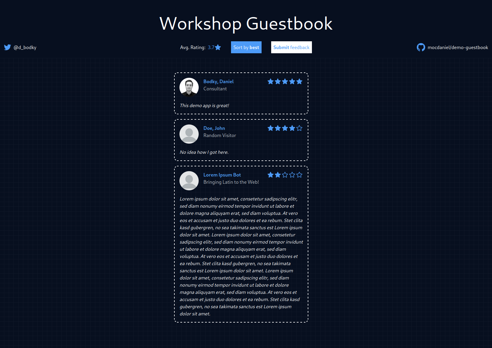

# Guestbook Demo

<p align="center">  </p>

This repository is my attempt of creating a project to use for various demos/workshops on different topics,
e.g. containerization, CI/CD, or various dev-tooling. **Therefore, development happens on an as-needed basis, 
and this code should not be used for anything else than demonstration purposes**.

The project is licensed under the **MIT License** - for more information, please head over to the [LICENSE](LICENSE).





## Architecture

### Frontend  


The application's **frontend** is written in **HTML/CSS/Typescript**, using **[VueJS](https://vuejs.org)**
as framework and **[TailwindCSS](https://tailwindcss.com)** for class-based styling.

### Backend 

The application's **backend** is written in [Go](https://golang.org).

### Building

The whole application gets built as a single Go-binary embedding the pre-built, static frontend files. For this, 
the correct **[build tag](https://pkg.go.dev/go/build#hdr-Build_Constraints)** needs to be set
(for more information, see [Building the application](https://github.com/mocdaniel/guestbook-demo#building-the-application)).

During development, the backend will serve the frontend from your local filesystem instead. For more information see [CONTRIBUTING.md](CONTRIBUTING.md).

### Data Persistence

The application itself is **stateless**, i.e. all information gets pulled/saved from/to external services. 
Therefore, a working **PostgreSQL** database and **Redis** cache need to be available and referenced at runtime 
(see [Running the Application](https://github.com/mocdaniel/guestbook-demo#running-the-application)).

The application saves entries to a **PostgreSQL database** after checking, if the anonymous user has already entered feedback before. 
For this to work, the application establishes an anonymous session for each visitor, 
caching their session and whether they have provided feedback before using **Redis**.

A session's lifetime is **24 hours**, entering additional feedback after 24 hours or by manually deleting the session cookie is possible **by design**.

## Building the Application

Building the application requires two separate steps - first building the VueJS frontend, then building the Go-binary
and embedding the pre-built, static frontend files.

### Building the Frontend

The frontend can be built by navigating to `./app/frontend` within the project's repository folder and issuing the following command:

```
npm run build

> guestbook-demo@1.0.0 build
> run-p type-check build-only


> guestbook-demo@1.0.0 type-check
> vue-tsc --noEmit


> guestbook-demo@1.0.0 build-only
> vite build

vite v3.1.8 building for production...
✓ 676 modules transformed.
dist/index.html                  0.42 KiB
dist/assets/index.476f5aef.css   10.35 KiB / gzip: 2.61 KiB
dist/assets/index.0ed272a2.js    93.31 KiB / gzip: 36.47 KiB
```

The static files can then be found at `./app/frontend/dist`.

### Building the Go Binary

As mentioned in the [Architecture](https://github.com/mocdaniel/guestbook-demo#architecture) section, the source code utilizes build tags
to differentiate between development environment and production behaviour. Therefore, building the Go binary looks like this:

```
go build -o guestbook -tags prod ./app
```

The output directory/name of the Go binary can be set by passing the `-o` flag, the `-tags prod` part is **mandatory**.

## Running the Application

The application exposes multiple settings which can be set using either **command line arguments** or **environment variables**.

### Configuration via Command Line

A list of all available command line arguments and their respective defaults can be displayed by passing the `--help`/`-h` flag:

```
./guestbook --help
Usage of ./guestbook:
      --db-host string            PostgreSQL server address (default "localhost")
      --db-max-idle-conns int     PostgreSQL max idle connections (default 25)
      --db-max-idle-time string   PostgreSQL max idle time (default "15m")
      --db-max-open-conns int     PostgreSQL max open connections (default 25)
      --db-name string            PostgreSQL database (default "guestbook")
      --db-password string        PostgreSQL password (default "password")
      --db-port int               PostgreSQL port (default 5432)
      --db-user string            PostgreSQL user (default "guestbook")
  -h, --help                      Prints this overview
      --port int                  Webserver port (default 8080)
      --redis-host string         Redis server address (default "localhost")
      --redis-port int            Redis port (default 6379)
      --redis-password string     Redis password (default "")
```

### Configuration via Environment Variables

Instead of passing runtime configuration via the command line, environment variables can be used instead. 

| Parameter Name       | Description                                                                                                |
|----------------------|------------------------------------------------------------------------------------------------------------|
| `GUESTBOOK_DB_HOST`           | PostgreSQL server address                                                            |
| `GUESTBOOK_DB_MAX_IDLE_CONNS`  | PostgreSQL max idle connections                                                            |
| `GUESTBOOK_DB_MAX_IDLE_TIME`   | PostgreSQL max idle time                                                              |
| `GUESTBOOK_DB_MAX_OPEN_CONNS`  | PostgreSQL max open connections                                                             |
| `GUESTBOOK_DB_NAME`           | PostgreSQL database                                                               |
| `GUESTBOOK_DB_PASSWORD`        | PostgreSQL password                                                                 |
| `GUESTBOOK_DB_PORT`            | PostgreSQL port                                                                          |
| `GUESTBOOK_DB_USER`            | PostgreSQL user                                                                    |
| `GUESTBOOK_PORT`              | Webserver port                                                                             |
| `GUESTBOOK_REDIS_HOST`         | Redis server address                                                               |
| `GUESTBOOK_REDIS_PORT`        | Redis port                                                                                |
| 'GUESTBOOK_REDIS_PASSWORD'    | Redis password |

## Deployment

Building the whole application into a single Go binary makes it easily deployable in a variety of ways. For some deployments, e.g. (Docker) Compose, resources are provided within this repository.

### Running the Go Binary

As mentioned in [Running the Application](https://github.com/mocdaniel/guestbook-demo#running-the-application) the application can be run on most OSes by executing the binary either manually:

```
./guestbook --db-host postgres.example.com --redis-host redis.example.com --db-user daniel --db-password supersecure
```

This will run the application in the foreground and log to stdout/stderr. In case you want to run it in the background,
you might want to look into creating a **systemd service file**.

### Running the Docker image standalone

This repository provides a [Dockerfile](Dockerfile), following best practices where possible. It builds the application 
similar to the steps described in [Building the Application](https://github.com/mocdaniel/guestbook-demo#building-the-application), 
using very slim and secure [images provided by Chainguard](https://www.chainguard.dev/chainguard-images).

For deploying via Docker, you first have to build the image:

```
docker build -t someuser/somename:someversion .
```

Then you can go on and run the application via Docker, either in the foreground or background (by providing the `-d` flag).
CLI parameters can be provided as **environment variables** or **cmd**, following the image specification:

```
# configure using environment variables
docker run -d -p 8080:8080 --name guestbook-demo \
-e GUESTBOOK_DB_HOST=postgres.example.com \
-e GUESTBOOK_REDIS_HOST=redis.example.com \
someuser/somename:someversion

# configure using CLI parameters
docker run -d -p 8080:8080 --name guestbook-demo someuser/somename:someversion \
--db-host=postgres.example.com \
--redis-host=redis.example.com
```

In case you need/want to delete the running container again, issue 

```
docker stop guestbook-demo
docker rm guestbook-demo
```

### Running the Docker Compose Stack

In addition to the Dockerfile, this repository provides a [compose.yml](compose.yml) file which defines a working 
environment for the guestbook-demo including **PostgreSQL** and **Redis** out of the box.

To deploy the whole stack either in fore- or background (again, provide the flag `-d`), just run the following command from the repository's root directory:

```
docker compose up -d 
```

This will build the application's Docker image as defined in the [Dockerfile](Dockerfile) and spin up three containers for the application, PostgreSQL, and Redis. If you need/want to delete the stack again, issue

```
docker compose down
```

from the repository's root directory.

## Contributing

As mentioned above, this is a demo repository and **not meant for real-world/production use**. 
Therefore, I plan on developing additional features on an as-needed basis and **won't accept Pull Requests introducing new features**. 
However, if you find lacking information, documentation or bugs to fix, feel free to open a Pull Request. 

Please see [CONTRIBUTING.md](CONTRIBUTING.md) for additional information on setting up your local developer environment etc.

## License

This project is licensed under the **MIT License**. A copy of the License text can be found within this repository at [LICENSE](LICENSE).
